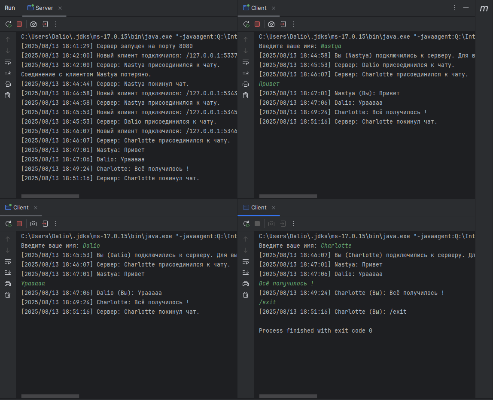

# Курсовой проект "Сетевой чат"

Консольное клиент-серверное приложение для обмена текстовыми сообщениями в реальном времени между несколькими пользователями. Проект реализован на Java с использованием Maven.

Этот документ содержит не только инструкцию по использованию, но и полное описание архитектуры и этапов реализации проекта.

## 🗂️ Содержание

- [Основные возможности](#-основные-возможности)
- [Стек технологий](#-стек-технологий)
- [Структура проекта](#-структура-проекта)
- [Отчет о реализации](#-отчет-о-реализации)
    - [Схема приложений](#схема-приложений)
    - [Архитектура и протокол обмена](#архитектура-и-протокол-обмена)
- [Тестирование](#-тестирование)
    - [Интеграционное тестирование](#интеграционное-тестирование)
    - [Unit-тестирование](#unit-тестирование)

## 🚀 Основные возможности

*   **Многопользовательский чат:** Сервер одновременно обрабатывает подключения неограниченного числа клиентов.
*   **Клиент-серверная архитектура:** Четкое разделение логики на сервер (управление) и клиенты (взаимодействие).
*   **Настройка через файл:** Порт и хост сервера легко настраиваются в файле `settings.txt`.
*   **Полное логирование:** Все сообщения и системные события (подключение/отключение) записываются в файл `file.log` и на сервере, и у каждого клиента. Файл дополняется при каждом запуске.
*   **Многопоточность:** Приложение эффективно использует потоки для неблокирующей обработки пользователей.
*   **Корректный выход:** Пользователи покидают чат с помощью команды `/exit`.

## 🛠️ Стек технологий

*   **Java 17**
*   **Maven** — система автоматической сборки проекта
*   **JUnit 5** — фреймворк для Unit-тестов

## 📂 Структура проекта

*   `Server.java`: Основной класс сервера. Принимает новые подключения и управляет списком клиентов.
*   `ClientHandler.java`: Класс, отвечающий за обработку одного клиента в отдельном потоке на стороне сервера.
*   `Client.java`: Основной класс клиента. Отвечает за подключение к серверу, отправку и получение сообщений.
*   `Logger.java`: Синглтон-класс для потокобезопасного логирования сообщений в файл `file.log`.
*   `src/main/resources/settings.txt`: Файл настроек для указания порта и хоста сервера.
*   `pom.xml`: Файл конфигурации Maven.

## 📝 Отчет о реализации

Этот раздел описывает архитектурные решения и этапы разработки проекта.

### Схема приложений

Архитектура построена по топологии **"звезда"**. В центре находится **Сервер**, который выступает в роли центрального узла (хаба). **Клиенты** не связаны друг с другом напрямую, каждое клиентское приложение устанавливает соединение только с сервером.

Когда один клиент отправляет сообщение, оно сначала поступает на сервер. Сервер, в свою очередь, рассылает это сообщение всем остальным подключенным клиентам.

```
                          +----------------+
                         |                  |
                         |     Сервер       |
                         | (localhost:8080) |
                         |                  |
                          +-------+--------+
                                  |
              +-------------------+-------------------+
              |                   |                   |
      (Соединение 1)      (Соединение 2)      (Соединение 3)
              |                   |                   |
      +-------+--------+  +-------+--------+  +-------+--------+
      |                |  |                |  |                |
      |    Клиент 1    |  |    Клиент 2    |  |    Клиент 3    |
      |    (Nastya)    |  |    (Dalio)     |  |  (Charlotte)   |
      |                |  |                |  |                |
      +----------------+  +----------------+  +----------------+
```

### Архитектура и протокол обмена

#### Архитектура Сервера
Сервер спроектирован для одновременной обработки нескольких клиентов с использованием многопоточности.

*   **Основной поток (Main Thread):**
    1.  При запуске считывает номер порта из `settings.txt`.
    2.  Создает `ServerSocket` и входит в бесконечный цикл ожидания `serverSocket.accept()`.
    3.  При подключении нового клиента, основной поток **мгновенно создает** для него экземпляр `ClientHandler` и **запускает его в новом потоке**.
    4.  Сразу после этого возвращается к ожиданию следующего клиента, обеспечивая постоянную доступность сервера.

*   **Потоки-обработчики (`ClientHandler`):**
    1.  На каждое клиентское соединение создается свой объект `ClientHandler`, работающий в отдельном потоке.
    2.  Этот поток в цикле читает сообщения от своего клиента.
    3.  При получении сообщения, он вызывает метод `broadcastMessage()` у сервера для рассылки всем остальным.
    4.  При получении команды `/exit` или при разрыве соединения, поток корректно закрывает ресурсы и удаляет клиента из общего списка.

#### Архитектура Клиента
Клиент также использует два потока, чтобы пользователь мог одновременно писать новые сообщения и получать входящие.

*   **Основной поток (Main Thread):**
    1.  Считывает настройки, запрашивает имя пользователя и подключается к серверу.
    2.  Запускает фоновый поток-слушатель для приема сообщений.
    3.  Сам остается в цикле, ожидая ввод пользователя из консоли и отправляя его на сервер.

*   **Поток-слушатель (Reader Thread):**
    1.  Работает в фоне и постоянно ждет входящие сообщения от сервера.
    2.  При получении сообщения, немедленно выводит его в консоль и записывает в лог.

#### Протокол обмена сообщениями
Используется простой текстовый протокол:
1.  **Идентификация:** Сразу после подключения клиент отправляет на сервер одну строку — свое имя.
2.  **Обмен сообщениями:** Все последующие строки от клиента — это сообщения чата. Сервер добавляет к ним имя отправителя (`Имя: текст`) перед рассылкой.
3.  **Завершение сеанса:** Клиент отправляет специальную строку `/exit` для корректного отключения.

## 🧪 Тестирование

### Интеграционное тестирование
Тестирование проводилось в два этапа.

1.  **Тест с помощью `telnet`:**
    *   После запуска сервера была выполнена команда `telnet localhost 8080`.
    *   Тест подтвердил, что сервер корректно принимает соединения и обрабатывает первые строки как имя пользователя, а последующие — как сообщения.

2.  **Тест с несколькими клиентами:**
    *   Был запущен один сервер и три экземпляра клиента.
    *   Тестировался сценарий: подключение всех клиентов, обмен сообщениями между ними, отключение одного из клиентов и продолжение работы чата.
    *   Тесты подтвердили, что сообщения доставляются корректно, а `file.log` обновляется у всех участников и на сервере.



### Unit-тестирование
Проект покрыт Unit-тестами с использованием JUnit 5. Тесты проверяют ключевую логику, например, корректность записи в лог-файл.
